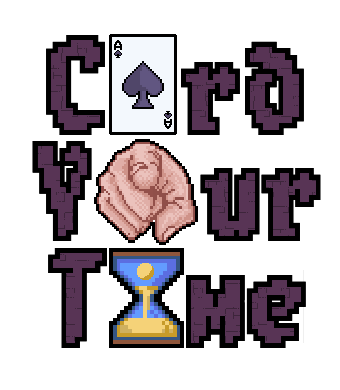

# Card Your Time - Hybrid Roguelike Card Game



**Card Your Time** to hybrydowa gra karciana łącząca elementy **roguelike** i **turowych gier karcianych**. Gracz
przemierza losowo generowane lochy, spotykając różne postacie i przeciwników. Kluczowe mechaniki to system czasu na turę
oraz połączenie ekwipunku z tworzeniem talii kart. W trakcie rozgrywki gracze eksplorują różne lokacje, walczą z
przeciwnikami, rozwijają swoje postacie i zbierają karty oraz przedmioty.

## Główne cechy gry

- **Turowy system czasu**: Każda karta ma koszt, który wpływa na czas oczekiwania na następną turę.
- **System kart i ekwipunku**: Ekwipunek wpływa na dostępne karty, które można użyć w walce.
- **Proceduralne generowanie lochów**: Każda rozgrywka oferuje unikalne doświadczenie dzięki losowo generowanym pokojom.
- **Walka na siatce**: Walki toczą się na siatce przypominającej szachownicę, gdzie każdy ruch ma znaczenie.
- **Rozbudowany system przedmiotów i kart**: Gracz może zbierać i łączyć karty, tworząc unikalne strategie.

## Inspiracje

Gra inspirowana jest takimi tytułami jak:

- **Wildfrost** 

- **Card Hunter**

- **Into the Breach** 

- **Metal Gear Acid** 

- **Crown Trick** 

- **Enter the Gungeon** 

- **Binding of Isaac** 

## Wymagania techniczne

- **Silnik**: Unity 2021.3 LTS
- **IDE**: Visual Studio lub Rider
- **Narzędzia graficzne**: Aseprite, Microsoft Paint
- **System dźwięku**: LabChirp, sfxr, DefleMask

## Instalacja:

[Gotowy plik](./documentation/img/gra.zip) (ale może nie zadziałać) w tym wypadku:

  ```bash
  git clone https://github.com/yourusername/card-your-time.git
  ```

1. Otwórz projekt w Unity.
2. Upewnij się, że masz zainstalowane wszystkie wymagane pakiety Unity (Addressables, Cinemachine, Input System).
3. Uruchom grę z poziomu Unity lub zbuduj projekt na wybraną platformę.

## Kontrola

- **Ruch**: W, A, S, D lub strzałki
- **Ekwipunek**: E
- **Menu pauzy**: Esc
- **Mapa**: M
- **Atak**: Lewy przycisk myszy
- **Anulowanie akcji**: Prawy przycisk myszy

## Licencja

Ten projekt jest objęty licencją MIT. Szczegóły można znaleźć w pliku [LICENSE](./License/README.md).

**Uwaga**: Możesz używać, modyfikować i rozpowszechniać ten projekt, ale nie  możesz go sprzedawać ani używać w celach komercyjnych bez zgody autorów. Całość kodu nie może być wykorzystywana w innych projektach bez  wyraźnej zgody autorów.

## Autorzy

- **Zakharii Zubyk** ([Z01berg](https://github.com/Z01berg))
- **Maksymilian Janas** ([**maXoXx0**](https://github.com/maXoXx0))
- **Juliusz Kupiński** ([**s22714**](https://github.com/s22714))
- **Jan Kajszczak** ([**JK-pjatk**](https://github.com/JK-pjatk))


(tak jesteśmy drużyną 13 stąd i nazwa😁)

## Podziękowania

Specjalne podziękowania dla **dr Kingi Skorupskiej** za opiekę nad projektem oraz **mgr inż. Barbary Karpowicz** za recenzję.


### Trailer i dokumentacja

- **Trailer gry**: [Trailer *alpha*;](./documentation/CardYourTime_Team13.mp4) [Trailer gameplay *release*](./documentation/gameplay.mp4) 
- **Dokumentacja**: [PDF](./documentation/_XRG__2023__skorupska__Team_13.pdf) 
- **Prezentacja**: [Przentacja](./documentation/[skorupska] 2023_Defense_PL_Team13.pptx)

------

### Uwaga

Projekt jest w trakcie rozwoju i może zawierać nieukończone funkcje. W  przyszłości planujemy dalszy rozwój gry, dodanie nowych mechanik i  ulepszenie istniejących. Zachęcamy do śledzenia postępów na naszym GitHubie.
